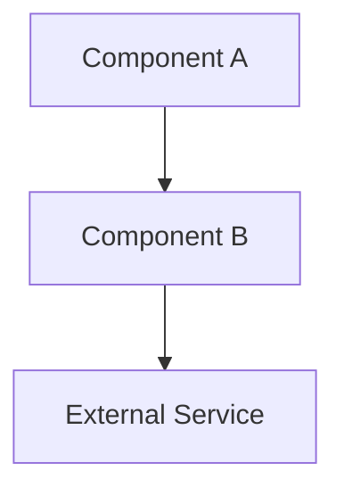
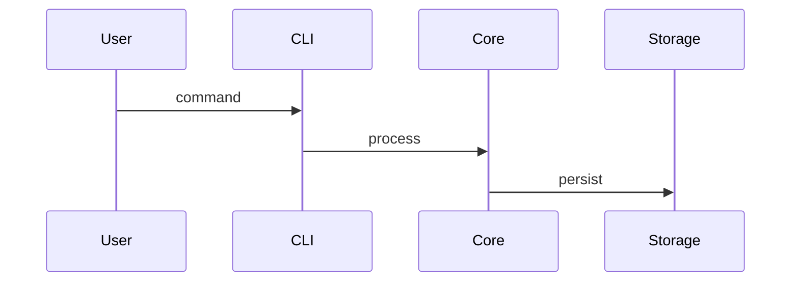

# Architecture Review

Document architectural decisions and keep `spec/architecture.md` synchronized with the codebase. Combines what was previously split between adr-review and architecture-updater.

## Setup

Identify the work item ID from user request or context.

Read:
1. `spec/features/<work-id>-<slug>/implementation.md` — key decisions section
2. `spec/features/<work-id>-<slug>/feature.md` — decisions section
3. `spec/decisions/` — existing ADRs (to determine the next ADR number)
4. `spec/architecture.md` — existing architecture doc (create stub if absent)
5. Recent file diffs if available

## Part 1: Identify Architectural Decisions

An ADR is warranted when any of the following occurred during the work item:
- A significant design choice was made between two or more viable alternatives
- A new external dependency was introduced
- An existing integration boundary was changed
- A new technology, framework, or pattern was adopted
- A performance, security, or scalability trade-off was accepted

For each candidate decision, ask:
- Was there a real alternative?
- Does the choice constrain future work?
- Would a new contributor ask "why was this done this way?"

If yes to any, the decision warrants an ADR. If none apply, skip to Part 3 (architecture sync).

## Part 2: Create ADRs

For each warranted decision, create `spec/decisions/ADR-<nnnn>-<slug>.md`:

```markdown
# ADR-<nnnn>: <Title>

**Date:** <YYYY-MM-DD>
**Status:** Accepted
**Work Item:** <work-id>

## Context
<Why this decision needed to be made. What problem does it solve?>

## Decision
<What was decided. State it clearly in one or two sentences.>

## Alternatives Considered
- <Alternative 1> — rejected because <reason>
- <Alternative 2> — rejected because <reason>

## Consequences
- <Positive consequence>
- <Negative consequence or trade-off accepted>

## Links
- [feature.md](../features/<work-id>-<slug>/feature.md)
```

Link the ADR from the `## Decisions` section of `feature.md`:
```
- [ADR-<nnnn>: <Title>](../../../spec/decisions/ADR-<nnnn>-<slug>.md)
```

## Part 3: Update `spec/architecture.md`

Sync the architecture doc with any structural changes. Maintain these sections:

**Overview** — one paragraph describing the system's purpose and key properties.

**Components** — bullet list of major components:
```markdown
- **<ComponentName>** — <one-line description of responsibility>
```

**Data Flow** — numbered step-by-step description of how data moves through the system for the primary use case.

**External Dependencies** — table of external services, libraries, or APIs:
```markdown
| Dependency | Purpose | Notes |
|---|---|---|
| <name> | <purpose> | <version or constraint> |
```

**Key Interfaces and Contracts** — boundaries between major components: inputs, outputs, invariants.

**Recent Changes** — brief log of significant architectural shifts, linked to ADRs.

## Part 4: Update Diagrams

Create or update `spec/diagrams/` using Mermaid syntax. Keep diagrams simple — capture structure, not every detail.

**Component diagram** (`spec/diagrams/components.md`):


**Data flow diagram** (`spec/diagrams/data-flow.md`):


## Completion Criteria

- [ ] All warranted decisions documented as ADRs (or none were warranted)
- [ ] ADRs linked from corresponding `feature.md` files
- [ ] `spec/architecture.md` reflects current codebase
- [ ] At least one diagram present and up to date (if any components exist)

## Handoff

Report what was done:
- ADRs created (with IDs and titles)
- Architecture sections updated
- Diagrams added or updated

Recommend the docs-update skill next to refresh `spec/index.md` so the new ADRs and architecture changes appear in the navigation hub.
