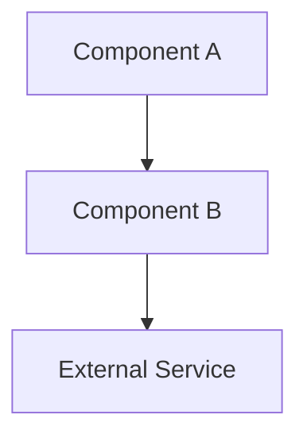
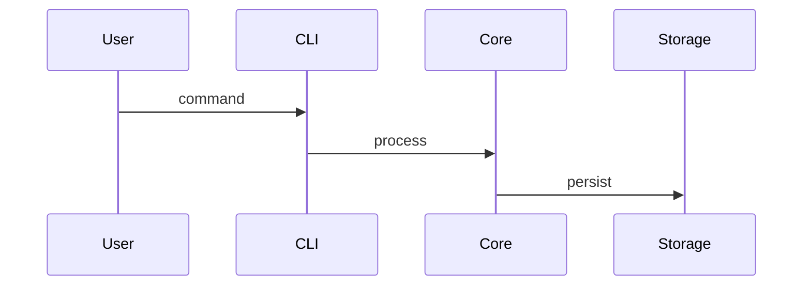

# Architecture Updater

Maintain alignment between the architecture documentation and the evolving codebase.

## Setup

Read in order:
1. `spec/architecture.md` — existing architecture doc (create stub if absent)
2. `spec/index.md` — navigation and current ADR list
3. `spec/decisions/` — recent ADRs that may affect the architecture
4. Key source files to verify current structure

## Process

### 1. Review existing documentation

Identify sections that are stale, missing, or contradicted by recent ADRs or code changes. Note what has changed since the last update.

### 2. Update `spec/architecture.md`

Maintain these sections:

**Overview** — one paragraph describing the system's purpose and key properties.

**Components** — bullet list of major components:
```markdown
- **<ComponentName>** — <one-line description of responsibility>
```

**Data Flow** — numbered step-by-step description of how data moves through the system for the primary use case.

**External Dependencies** — table of external services, libraries, or APIs:
```markdown
| Dependency | Purpose | Notes |
|---|---|---|
| <name> | <purpose> | <version or constraint> |
```

**Key Interfaces and Contracts** — describe the boundaries between major components: inputs, outputs, and invariants.

**Recent Changes** — brief log of significant architectural shifts, linked to ADRs where applicable.

### 3. Update or create diagrams

Create or update `spec/diagrams/` using Mermaid syntax:

**Component diagram** (`spec/diagrams/components.md`):


**Data flow diagram** (`spec/diagrams/data-flow.md`):


Keep diagrams simple — capture structure, not every detail.

### 4. Update `spec/index.md`

Ensure `spec/index.md` links to `spec/architecture.md` and lists the most recent ADR under the Decisions section.

## Completion Criteria

- [ ] `spec/architecture.md` reflects current codebase
- [ ] All component and data-flow descriptions are accurate
- [ ] At least one diagram is present and up to date
- [ ] `spec/index.md` links to architecture and current ADRs
